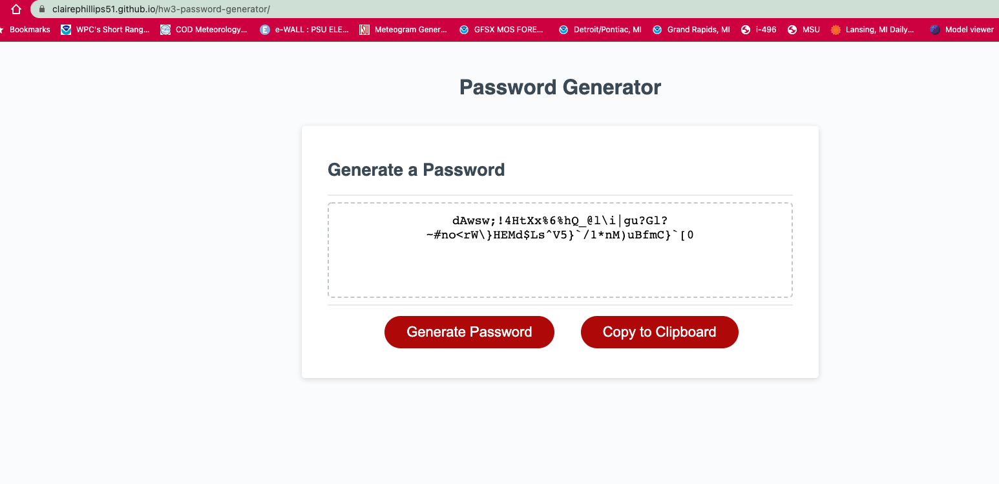
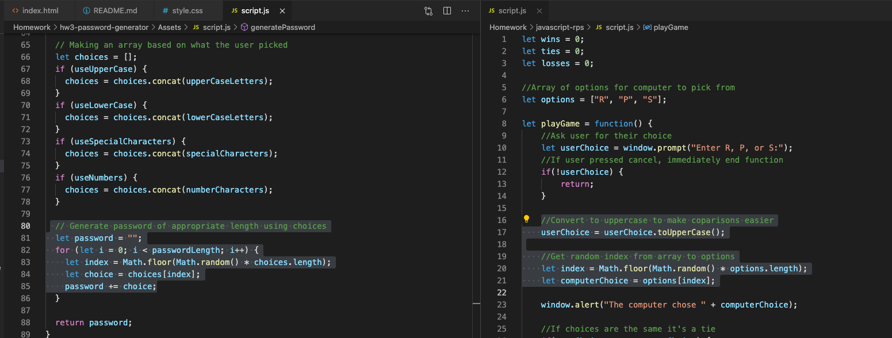
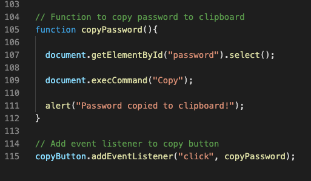

# hw3-password-generator

# Javascript Random Password Generator
Link: [Password Generator](https://clairephillips51.github.io/hw3-password-generator/)

## Summary
Using javascript to write functions so that when a button is clicked a random password will be generated based on parameters picked by the user. The focus of this project was to have guided prompts that make a user first pick a password length between 8-128 characters. The user can then pick whether or not to include uppercase letters, lowercase letters, numbers, and special characters in the password. At least one of these parameters must be picked and once all requirements are met a random password will be generated.  

## Table of Contents
1. [Process](#process)
2. [Usage](#usage)
3. [What I Learned](#what-i-learned)
4. [Resources](#resources)

## Process
This project started with complete html and css files. The javascript file has some initial elements and the bases for the main functions needed. My task was to make additional arrays for the various parameters and then create the main generatePassword function. 
Additional functions were also needed to set up the guided prompts. The most difficult part for me was how to actually get the function to pick a random string of numbers, letters, and special characters based on what the user picked.

I was thinking I would need the Math.random() function but that would only return random floats between 0 and 1, not letters and characters. What helped was looking back at the rock-paper-scissors game where we generated a random index, then used that index to selected the associated element in an array of choices. I applied this same concept to our array of character choices.

Once that hurdle was passed, getting the generatePassword function to return a random string worked. The rest was making sure the addEventListner worked for both buttons. 

## Usage
The basis of this password generator looks simple. When the page opens you click the random generator button and are greeted with 5 prompts. The user is first asked to choose a length between 8-128 characters. Once an appropriate length is chosen they will be asked if they want to include uppercase letters, lowercase letters, numbers, and special characters. They can choose “yes” or “cancel”. After the user is guided through the choice prompts and made their choices, a random password will be given in the textbox. Multiple functions are used for the choice prompts. Then additional functions are used to output a random password and then get the buttons to work.

I wanted to challenge myself with this project and added an additional button that copies whatever password is generated to the clipboard so it can be posted into whatever form is needed. It was fairly simple to copy the `<button>` tag from the html and add the same syles in the css file. In javascript I added an additional EventListner and then wrote a simple function that responded to “click”. 

## What I Learned
This project was daunting at first thinking about how to tackle the entire process of getting a random output was too confusing. I turned it into a step by step approach and did the easy things first. 
I set up the arrays for the letters, numbers, and special characters. Then I wrote the functions that would trigger the prompts for the user to click through.
I then wrote and re-wrote (cried a little) the function used to generate the password output. This took the most time and plenty of research. I did get good practice for writing methods and also used a few while loops in the choice prompt functions. We had not gone indepth about this in class but when researching loops the while loop was better to use to track that the value input for the string length was in fact an integer and not a string. 
I also learned more about the usage of adding EventListeners and connecting them to specific html tags (the buttons in this case). 

## Resources
* [Math.floor(Math.random())](https://www.w3schools.com/js/js_random.asp)
* [W3schools function explanation](https://www.w3schools.com/js/js_functions.asp)
* [Similar password generator setup](https://dev.to/olawanle_joel/password-generator-with-javascript-57c)
* [addEventListener w3school resource](https://www.w3schools.com/jsref/met_element_addeventlistener.asp) 
* [w3schools While Loop](https://www.w3schools.com/js/js_loop_while.asp)
